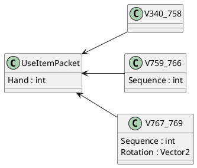

# Мультиверсия

Одна из ключевых особенностей McProtoNet — это поддержка мультиверсии,
которая позволяет работать с различными версиями протокола Minecraft,
без необходимости переписывать код под каждую из них.
Протокол Minecraft часто изменяется между версиями, и один и тот же пакет,
например, `UseItem`, может иметь разную структуру в зависимости от версии.

McProtoNet поддерживает работу с версиями начиная с %min_minecraft_version% заканчивая
%max_minecraft_version%. На протяжении этого диапазона версий структура пакета `UseItem` претерпевала множество изменений:


<tabs>
<tab title="340-758">
<table>
    <tr>
        <td>Имя</td>
        <td>Тип</td>
    </tr>
    <tr>
        <td>Hand</td>
        <td>VarInt</td>
    </tr>
</table>
</tab>
<tab title="759-766">
<table>
    <tr>
        <td>Имя</td>
        <td>Тип</td>
    </tr>
    <tr>
        <td>Hand</td>
        <td>VarInt</td>
    </tr>
    <tr>
        <td>Sequence</td>
        <td>VarInt</td>
    </tr>
</table>
</tab>
<tab title="767-769">
<table>
    <tr>
        <td>Имя</td>
        <td>Тип</td>
    </tr>
    <tr>
        <td>Hand</td>
        <td>VarInt</td>
    </tr>
    <tr>
        <td>Sequence</td>
        <td>VarInt</td>
    </tr>
    <tr>
        <td>Rotation</td>
        <td>Vector2</td>
    </tr>
</table>
</tab>
</tabs>

## Главная идея

Особенность мультиверсии McProtoNet заключается в том, что классы, описывающие пакеты,
содержат только те поля, которые присутствуют во всех версиях пакета. Например, для `UseItem`
основной класс будет содержать только поле `Hand`. Однако, помимо основного класса, существуют
вложенные классы, которые наследуются от него и добавляют недостающие поля для конкретных версий.



### Сериализация пакета

Все классы реализуют интерфейс `IClientPacket`(для клиентских пакетов). 

<code-block lang="C#" collapsed-title="IClientPacket.cs" collapsible="true">
public interface IClientPacket
{
    public void Serialize(ref MinecraftPrimitiveWriter writer, int protocolVersion);

    public static virtual ClientPacket PacketId { get; }
    public ClientPacket GetPacketId();

    public static virtual bool SupportedVersion(int protocolVersion) => throw new NotImplementedException();
}
</code-block>

Этот интерфейс содержит метод `Serialize`,
который непосредственно занимается сериализацией пакета в поток.
Для обеспечения мультиверсии этот метод принимает в качестве аргумента число &mdash; версию протокола.

Вложенные классы сериализуют все свои поля, а вот базовый только общие. Остальные же используют значение по умолчанию.

Например, так выглядит полный класс для `UseItem` пакета:

<code-block lang="C#" collapsed-title="UseItemPacket.cs" collapsible="true" src="../code-samples/UseItemPacket.cs"/>

### Серверные пакеты

Серверные пакеты в McProtoNet спроектированы схожим образом:
основной класс содержит общие поля, применимые ко всем версиям, а вложенные классы включают дополнительные поля, характерные для конкретных версий.

Основной класс является абстрактным, тогда как вложенные классы — нет. При десериализации пакета метод вызывается у конкретного наследника, соответствующего текущей версии протокола.

#### Как создаются серверные пакеты

В отличие от отправки, при получении серверных пакетов McProtoNet самостоятельно создает экземпляры классов. Для этого используется словарь, где:

- ключ — комбинация версии протокола и идентификатора пакета,
- значение — фабричный метод, создающий экземпляр нужного класса.

---

#### Пример: пакет `UnloadChunk`

Пакет UnloadChunk содержит одинаковые поля для всех версий: координаты X и Z. Однако начиная с версии 764 порядок чтения этих полей изменился.

<code-block lang="C#" collapsed-title="UnloadChunkPacket.cs" collapsible="true" src="../code-samples/UnloadChunkPacket.cs"/>


#### Структура словаря пакетов

В словаре пакетов множество записей, каждая из которых сопоставляет комбинацию версии и идентификатора пакета фабричному методу. Для примера рассмотрим две записи:

```C#
{
    Combine(351, 30),
    UnloadChunkPacket_V340_763Factory
}
```

```C#
{
    Combine(766, 33),
    UnloadChunkPacket_V764_769Factory
}
```

<note>
Метод <code>Combine</code> принимает два 32-битных числа и преобразует их в 64-битное. Первые 32 бита — первое число, вторые 32 бита — второе.
</note>

---

#### Как это работает

- Если версия протокола равна **351**, а идентификатор пакета — **30**, вызывается фабрика `UnloadChunkPacket_V340_763Factory`, создающая экземпляр класса `UnloadChunkPacket.V340_763`.
- Если версия протокола равна **766**, а идентификатор пакета — **33**, используется фабрика `UnloadChunkPacket_V764_769Factory` для создания экземпляра `UnloadChunkPacket.V764_769`.


## Примеры кода

Дабы глубже углубиться в идею мультиверсии, рассмотрим примеры кода.

### Отправка пакетов

Для работы с клиентскими пакетами в McProtoNet необходимо подключить соответствующие пространства имен. 

Убедитесь, что в коде импортированы:

```C#
using McProtoNet.Protocol;
using McProtoNet.Protocol.ServerboundPackets;
```

А также подключена библиотека:

```xml
<PackageReference Include="McProtoNet.Protocol" Version="XXX" />
```

#### Задача - отправить `BlockPlace` пакет

Если нас не волнует версия, то можно сделать это так.

```C#
using McProtoNet;
using McProtoNet.Client;
using McProtoNet.Protocol;
using McProtoNet.Protocol.ServerboundPackets;

var client = new MinecraftClient
{
    //Initialize
};
var packet = new BlockPlacePacket
{
    CursorX = 1.0f,
    CursorY = 2.0f,
    CursorZ = 3.0f,
    Direction = 4,
    Hand = 5,
    Location = new Position(6, 7, 8)
};
await client.SendPacket(packet);
```

В конце вызывается метод `SendPacket` - это метод расширения, который в 
качестве параметра принимает экземпляр класса, реализующий `IClientPacket`.

Если нас интересует конкретная версия, допустим, **477**, то можно
сделать так:

```C#
var packet = new BlockPlacePacket.V477_758()
{
    CursorX = 1.0f,
    CursorY = 2.0f,
    CursorZ = 3.0f,
    Direction = 4,
    Hand = 5,
    Location = new Position(6, 7, 8),
    InsideBlock = true //Новое поле
};
await client.SendPacket(packet);
```
Но стоит быть осторожным, так как McProtoNet проверят, поддерживает ли этот пакет
версию протокола на которой запущен клиент. Чтобы упростить это можно использовать
метод расширения `TrySend`:

```C#
if (client.TrySend<BlockPlacePacket.V477_758>(out var sender))
{
    sender.Packet.CursorX = 1.0f;
    sender.Packet.CursorY = 2.0f;
    sender.Packet.CursorZ = 3.0f;
    sender.Packet.Direction = 4;
    sender.Packet.Hand = 5;
    sender.Packet.Location = new Position(6, 7, 8);
    sender.Packet.InsideBlock = true;

    await sender.Send();
}
```

### Получение серверных пакетов

С отправкой разобрались. 