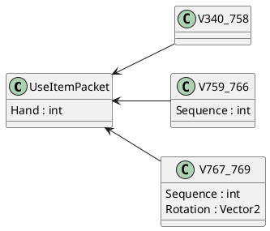

# Мультиверсия

Одна из ключевых особенностей McProtoNet — это поддержка мультиверсии,
которая позволяет работать с различными версиями протокола Minecraft,
без необходимости переписывать код под каждую из них.
Протокол Minecraft часто изменяется между версиями, и один и тот же пакет,
например, `UseItem`, может иметь разную структуру в зависимости от версии.

McProtoNet поддерживает работу с версиями начиная с %min_minecraft_version% заканчивая
%max_minecraft_version%. На протяжении этого диапазона версий структура пакета `UseItem` претерпевала множество изменений:

<tabs>
<tab title="340-758">
<table>
    <tr>
        <td>Имя</td>
        <td>Тип</td>
    </tr>
    <tr>
        <td>Hand</td>
        <td>VarInt</td>
    </tr>
</table>
</tab>
<tab title="759-766">
<table>
    <tr>
        <td>Имя</td>
        <td>Тип</td>
    </tr>
    <tr>
        <td>Hand</td>
        <td>VarInt</td>
    </tr>
    <tr>
        <td>Sequence</td>
        <td>VarInt</td>
    </tr>
</table>
</tab>
<tab title="767-769">
<table>
    <tr>
        <td>Имя</td>
        <td>Тип</td>
    </tr>
    <tr>
        <td>Hand</td>
        <td>VarInt</td>
    </tr>
    <tr>
        <td>Sequence</td>
        <td>VarInt</td>
    </tr>
    <tr>
        <td>Rotation</td>
        <td>Vector2</td>
    </tr>
</table>
</tab>
</tabs>

## Главная идея

Особенность мультиверсии McProtoNet заключается в том, что классы, описывающие пакеты,
содержат только те поля, которые присутствуют во всех версиях пакета. Например, для `UseItem`
основной класс будет содержать только поле `Hand`. Однако, помимо основного класса, существуют
вложенные классы, которые наследуются от него и добавляют недостающие поля для конкретных версий.

## Сериализация пакета

Все классы реализуют интерфейс `IClientPacket`(для клиентских пакетов). 

<code-block lang="C#" collapsed-title="IClientPacket.cs" collapsible="true">
public interface IClientPacket
{
    public void Serialize(ref MinecraftPrimitiveWriter writer, int protocolVersion);

    public static virtual ClientPacket PacketId { get; }
    public ClientPacket GetPacketId();

    public static virtual bool SupportedVersion(int protocolVersion) => throw new NotImplementedException();
}
</code-block>

Этот интерфейс содержит метод `Serialize`,
который непосредственно занимается сериализацией пакета в поток.
Для обеспечения мультиверсии этот метод принимает в качестве аргумента число &mdash; версию протокола.

Вложенные классы сериализуют все свои поля, а вот базовый только общие. Остальные же используют значение по умолчанию.

Например, так выглядит полный класс для `UseItem` пакета:

<code-block lang="C#" collapsed-title="UseItemPacket.cs" collapsible="true" src="../code-samples/UseItemPacket.cs"/>

## Серверные пакеты

